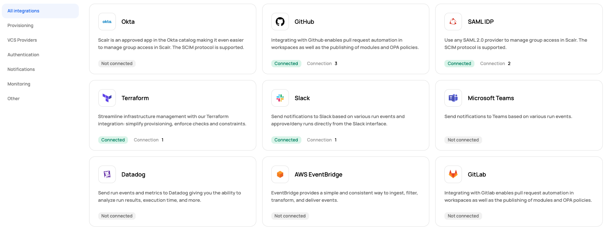

# [Scalr] 15. 솔루션 통합 현황 관리 여부

## Menu 
Administration > Integrations

## 점검 방법 
`GitHub`, `Okta`, `Webhook` 등 각 Integration 별 **Status**를 확인합니다. 불필요한 장기간 미사용 또는 통합 사유가 불분명한 통합 건에 대해서는 연결을 해제합니다. 

## 관련 통제 항목 (ISMS-P)
- 2.7.2 암호키 관리
- 2.10.1 보안시스템 운영
- 2.10.2 클라우드 보안