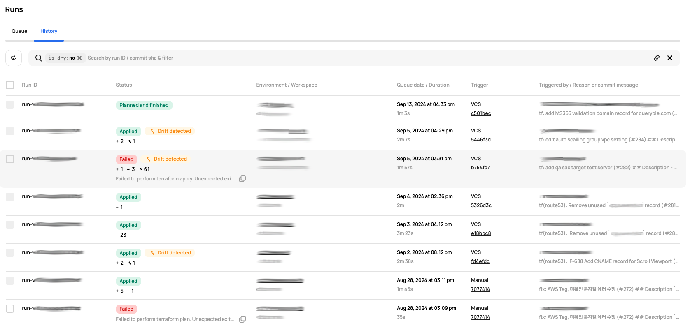
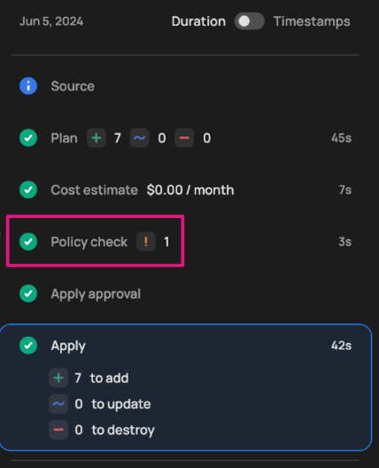
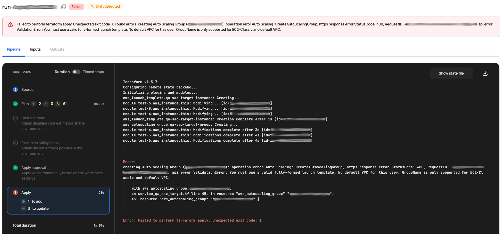

# [Scalr] 16. 리소스 배포 승인 이력 및 변경 관리 현황 검토

## Menu 
Administration > Inventory > Runs

## 점검 방법 
**History** 탭에서 각 워크스페이스에서의 최근 Terraform 또는 OpenTofu 배포 승인 이력에 대한 현황을 주기적으로 검토하는 프로세스를 이행하고 있는지 확인합니다. (`Dry` 태그가 달린 dry run 항목 제외) 

- **Trigger** 컬럼에서 `Manual`로 각 실행 이력에 대한 오너 중 권한 외의 사용자가 수행한 이력이 없는지 검토하여 변경이력을 추적합니다. 

- 각 실행 이력 내 **Pipeline**에서 `policy check`를 통해 OPA가 정상적으로 적용되어 검토되었는지 확인합니다. 

- **Status**가 `Failed`로 나온 이력에 대한 배포 오너의 사유 확인 및 조치 여부를 주기적으로 검토하고 관리하는 프로세스를 이행하는지 점검합니다.

## 관련 통제 항목 (ISMS-P)
- 2.9.1 변경관리
- 2.10.1 보안시스템 운영
- 2.10.2 클라우드 보안