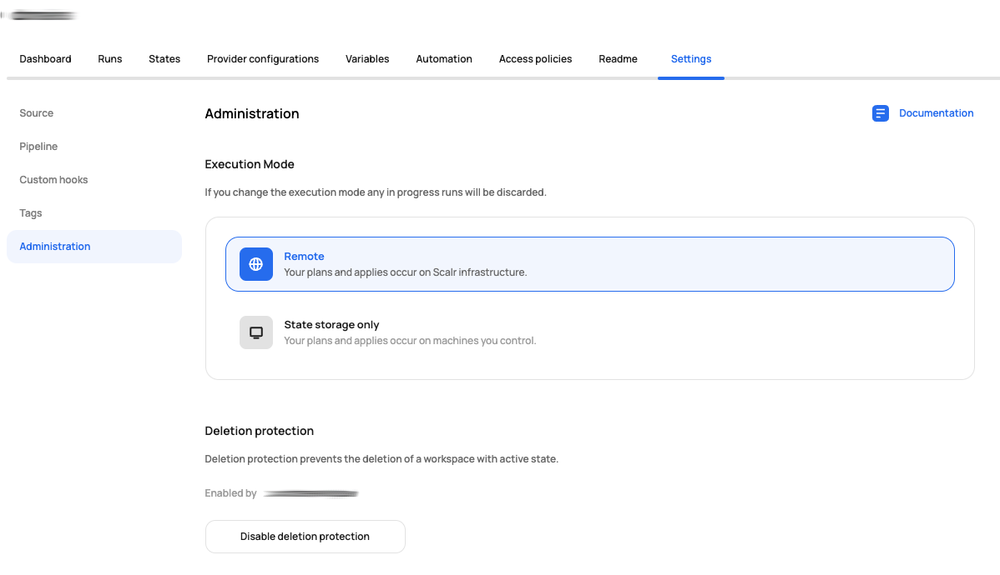

# [Scalr] 17. 워크스페이스 별 무분별한 삭제 방지 대응 여부

## Menu 
Administration > Inventory > Workspaces

## 점검 방법 
각 워크스페이스 별 `Settings > Administration`에 **Deletion protection** 활성화를 통한 Active 워크스페이스에 대한 무분별한 삭제 방지 조치 여부를 확인합니다. 

## 관련 통제 항목 (ISMS-P)
- 2.10.2 클라우드 보안
- 2.11.1 사고 예방 및 대응체계 구축
- 2.11.5 사고 대응 및 복구