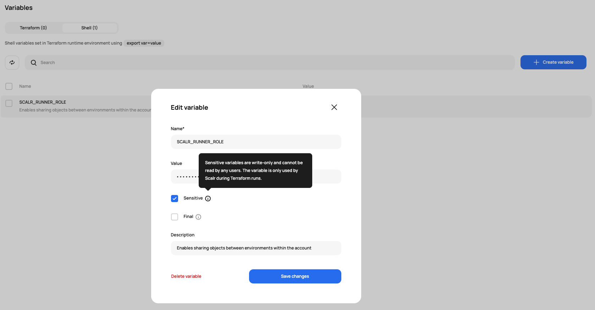

# [Scalr] 18. 환경 변수 내 민감 정보 노출 점검

## Menu 
Administration > Inventory > Variables

## 점검 방법 
`Terraform` 및 `Shell`에 저장된 각 항목 내 비밀번호, Secret 등 민감 정보의 경우 **Sensitive** 옵션이 체크되어 플레인 텍스트로 공개되지 않도록 설정되어 있는지 검토합니다. 

## 관련 통제 항목 (ISMS-P)
- 2.5.4 비밀번호 관리